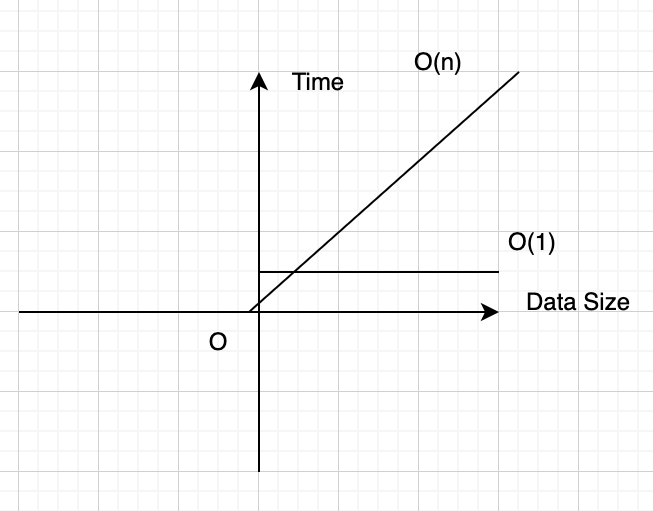
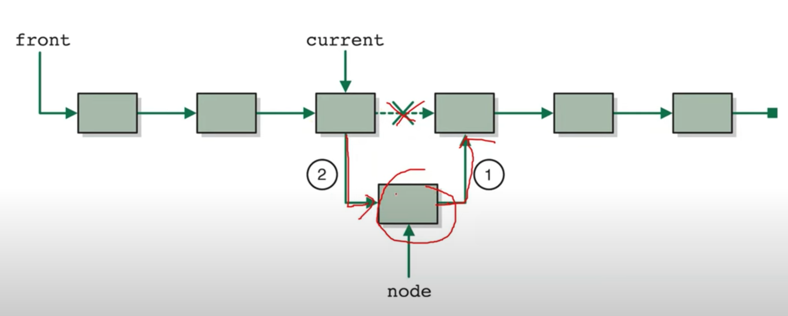

**Khái niệm về độ phức tạp?**

Khái niệm về độ phức tạp O(n) O(1)

-> Sự tương quan giữa thời điểm hiện tại của thuật toán và độ lớn của dữ liệu

Ví dụ trục Oxy thì trục y là time của trục x là độ lớn dữ liệu
O(1) thì như 1 đường thẳng song song với trục Ox
còn O(n) giống như một đường thẳng tăng tiến

=> khi dữ liệu ít thì nó chạy nhanh (trục Oy), khi dữ liệu nhiều thì nó sẽ chạy chậm



Ví dụ:

một array [1,2,3,4,5] sẽ được khai báo length ngay từ đầu là 5 ô trong bộ nhớ. Việc xóa số 3 từ array thì độ phức tạp O(1)

Tuy nhiên nếu mộ array từ 1 -> một số siêu lớn thì độ phức tạp sẽ tăng O(n), bởi vì khi lấy ra 1 số thì số kế bên phải dịch chuyển vào khoảng trống của số mới dời đi. array [1,2,3,4,5] thì chỉ dịch chuyển 4 và 5 nên không mất nhiều time so với dịch chuyển so với mảng nhiều số lớn hơn -> O(n).

Do đó, người ta tạo ra linked list để giải quyết vấn đề O(n) mà chỉ tốn O(1) thôi. Đó là không cần phải khai báo bộ nhớ cố định ngay từ đầu nên kích thước linh hoạt

=> Tuy vậy, kích thước linh hoạt thì nó sẽ gây ra nhược điểm là yêu cầu bộ nhớ nhiều hơn do cần lưu trữ các con trỏ(chi phí cao hơn so với khai báo mảng thông thường).

**Linked list?**

nó là những cái node nối nhau. Thì cái này, ví dụ mà muốn xóa một thằng thì xóa là nó mất tiêu, không cần phải dịch chuyển thằng kế bên làm gì hết.

Nhược điểm : Muốn gọi đến thằng thứ n thì phải loop n lần => Không có thuật toán nào là hoàn hảo.

**Mảng liên kết đơn là gì ? (singly linked list)**

- Một hàng các node có phần đầu (head) và phần kết thúc
- Mỗi node gồm (data và con trỏ next để liên kết với nút tiếp theo)
- Node cuối cùng trỏ đến null.

**Code**

Định nghĩa một nút (node)

```javascript
class Node {
  constructor(data) {
    this.data = data;
    this.next = null;
  }
}
```

**constructor(data)**: Đây là hàm khởi tạo của lớp Node. Hàm này sẽ được gọi mỗi khi bạn tạo một đối tượng mới từ lớp Node.

**this.data = data;**: this.data là thuộc tính của đối tượng Node, được sử dụng để lưu trữ giá trị mà nút sẽ giữ. data là tham số mà bạn truyền vào khi tạo một đối tượng Node mới. Ví dụ, nếu bạn tạo một nút mới với new Node(5), thì data sẽ là 5 và this.data sẽ lưu trữ giá trị 5.

**this.next = null;**: this.next là thuộc tính dùng để lưu trữ tham chiếu đến nút tiếp theo trong danh sách. Ban đầu, nó được gán giá trị null vì khi tạo một nút mới, nó chưa liên kết với bất kỳ nút nào khác. Sau này, bạn có thể thay đổi giá trị của this.next để liên kết nó với một nút khác trong danh sách.

VÍ DỤ :

```javascript
// Định nghĩa lớp Node
class Node {
  constructor(data) {
    this.data = data; // Lưu trữ dữ liệu của nút
    this.next = null; // Con trỏ đến nút tiếp theo (ban đầu là null)
  }
}

// Tạo một số nút mới
const node1 = new Node(10);
const node2 = new Node(20);

// Kết nối node1 đến node2
node1.next = node2;

console.log(node1); // In ra: Node { data: 10, next: Node { data: 20, next: null } }
console.log(node2); // In ra: Node { data: 20, next: null }
```

**constructor():** Phương thức khởi tạo của lớp LinkedList được gọi khi bạn tạo một đối tượng mới của lớp này. Nó thiết lập thuộc tính head là null, điều này có nghĩa là danh sách bắt đầu với trạng thái rỗng (chưa có nút nào).

```javascript
class linkedList {
  constructor() {
    this.head = null;
  }
}
```

**Phân tích addToList(data)**

**Chức năng:** Phương thức append(data) được sử dụng để thêm một nút (node) mới với giá trị data vào cuối danh sách liên kết.

`  addToList(data) {`

**Kiểm tra danh sách có rỗng?**

```javascript
if (this.head === null) {
  this.head = newNode;
}
```

Nếu danh sách đang rỗng, thì nút mới newNode sẽ trở thành nút đầu tiên trong danh sách (this.head = newNode).

**Nếu danh sách không rỗng**

```javascript
else {
  let current = this.head;
  while (current.next !== null) {
    current = current.next;
  }
  current.next = newNode;
}

```

Biến current bắt đầu từ this.head và di chuyển qua các nút liên tiếp bằng cách cập nhật current = current.next cho đến khi gặp nút cuối (khi current.next là null).


